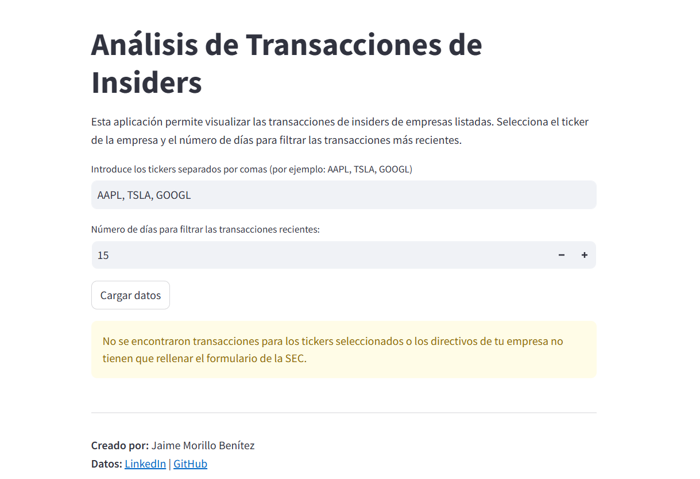
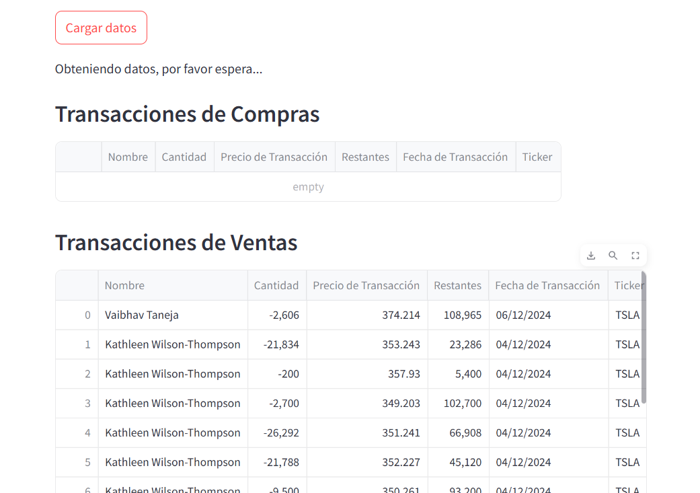
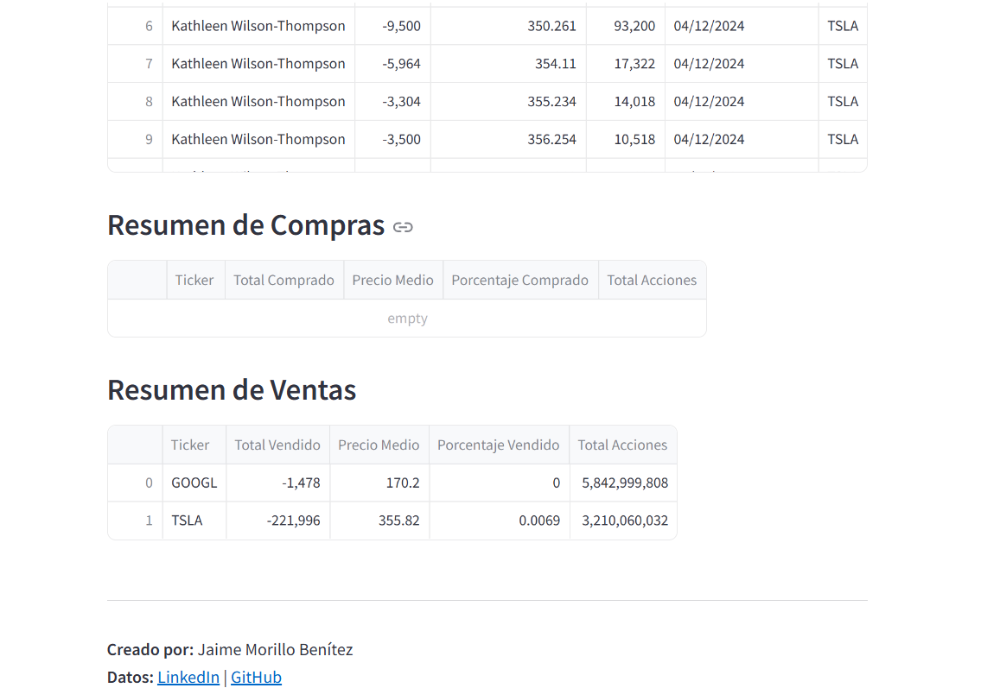

# Insider Trading Tracker

## Descripción

**Insider Trading Tracker** es una aplicación interactiva desarrollada con **Streamlit** que te permite visualizar y analizar las transacciones internas de directivos y empleados clave de empresas cotizadas en bolsa de EE. UU. Estas transacciones deben ser reportadas a la **SEC** (Securities and Exchange Commission), y este proyecto permite ver esas transacciones en un formato claro y accesible.

Este proyecto está diseñado para facilitar el análisis de las compras y ventas de acciones por parte de ejecutivos, lo que puede ser útil para inversores o cualquier persona interesada en seguir la actividad de insiders en el mercado.

## Características

- **Visualización interactiva** de las transacciones internas de ejecutivos.
- **Filtrado** de datos por empresa, director y fecha.
- Resúmenes y **métricas clave** sobre las transacciones.
- **Datos actualizados** sobre las transacciones reportadas a la SEC.
  
## Tecnologías Utilizadas

- **Python** para el análisis de datos.
- **Streamlit** para la creación de la interfaz web interactiva.
- **Pandas** para la manipulación y análisis de los datos.

## Visualización Previa

Aquí hay algunas capturas de pantalla de la aplicación:

### Web Preview


### Ejemplo 1


### Ejemplo 2


Puedes instalar todas las dependencias necesarias ejecutando:

```bash
pip install -r requirements.txt
